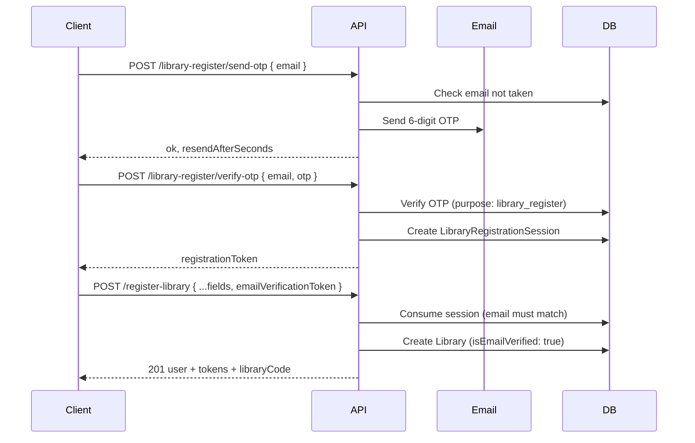

# Library registration

How a **new library tenant** signs up in SmartLibDesk: email verification during signup, API contract, environment variables, and what happens after success.

All endpoints below are **public** (no JWT required until registration completes).

---

## Overview

Registration is a **three-step** flow:

1. **Send OTP** — prove the email is reachable and not already registered.
2. **Verify OTP** — receive a one-time `registrationToken` (short-lived server session).
3. **Register library** — submit the full form with `emailVerificationToken` set to that token.

The library is created with **`isEmailVerified: true`** and **`emailVerifiedAt`** set immediately — no separate post-login email verification step.



---

## Where it lives in the app

| Platform | Entry |
|----------|--------|
| **Native (Expo)** | Login → **Register**, or stack screen `RegisterLibrary` |
| **Web** | Path `/register-library` (see `frontend/navigation/linking.ts`) |

| Layer | File |
|-------|------|
| UI | `frontend/screens/auth/RegisterLibraryScreen.tsx` |
| Web wrapper | `frontend/pages/RegisterLibraryPage.tsx` |
| Register API | `backend/src/routes/auth.routes.js` → `POST /register-library` |
| Email OTP API | `backend/src/routes/emailOtp.routes.js` |
| Business logic | `backend/src/services/auth.service.js` → `registerLibrary` |
| OTP + session | `backend/src/services/emailOtp.service.js`, `backend/src/models/LibraryRegistrationSession.js` |

---

## Prerequisites

1. **Backend** running with MongoDB and email configured (`RESEND_API_KEY`, `EMAIL_FROM` in `backend/.env`).
2. **Frontend** can reach the API (`EXPO_PUBLIC_API_URL` or your Axios base URL).

See root `README.md` for install and env setup.

---

## Step 1 — Send email OTP

**`POST /api/auth/library-register/send-otp`**

Rate limit: **5 requests / 15 minutes** per IP (`emailOtpLimiter`).

### Request

```json
{
  "email": "owner@example.com"
}
```

### Success (`200`)

```json
{
  "ok": true,
  "message": "Verification code sent to your email.",
  "expiryMinutes": 10,
  "resendAfterSeconds": 60
}
```

### Errors

| Status | When |
|--------|------|
| **400** | Missing or invalid email |
| **409** | Email already registered as a library |
| **429** | Too many OTP requests |

OTP purpose in DB: `library_register` (`EmailOtp` model).

---

## Step 2 — Verify OTP

**`POST /api/auth/library-register/verify-otp`**

Rate limit: **25 requests / 15 minutes** per IP.

### Request

```json
{
  "email": "owner@example.com",
  "otp": "123456"
}
```

### Success (`200`)

```json
{
  "ok": true,
  "registrationToken": "64-char-hex-one-time-token",
  "sessionExpiresMinutes": 30
}
```

Store `registrationToken` client-side. It is **single-use** and must be sent as `emailVerificationToken` on register. Default TTL: **30 minutes** (`LIBRARY_REGISTRATION_SESSION_TTL_MINUTES`).

### Errors

| Status | When |
|--------|------|
| **400** | Missing email or OTP, invalid email |
| **401** | Wrong or expired OTP, max attempts exceeded |
| **429** | Too many verify attempts |

If the user changes the email field after verify, the client should clear the stored token and verify again.

---

## Step 3 — Register library

**`POST /api/auth/register-library`**

### Request body

| Field | Required | Notes |
|-------|----------|--------|
| `libraryName` | Yes | Public name of the library |
| `ownerName` | Yes | Account owner / contact name |
| `email` | Yes | Must match the email used in steps 1–2; lowercased server-side; **unique** |
| `emailVerificationToken` | Yes | `registrationToken` from step 2 |
| `password` | Yes | Stored hashed (bcrypt) |
| `city` | Yes | From India state/city picker |
| `state` | Yes | State or Union Territory |
| `place` | Yes | Area, landmark, or locality (max 200 chars) |
| `pincode` | Yes | Exactly **6 digits** (non-digits stripped) |
| `phone` | Yes | India mobile: **10 digits**; optional leading `91` accepted. Alias: `mobile` |

**Client-only (not in register body):** **Total seats** (`1`–`5000`). After `201`, the app calls authenticated `POST /api/seats/bulk-create` with `{ totalSeats, spaceId: null }`.

### Example

```json
{
  "libraryName": "Demo Library",
  "ownerName": "Owner Name",
  "email": "owner@example.com",
  "emailVerificationToken": "YOUR_REGISTRATION_TOKEN_FROM_STEP_2",
  "password": "YourSecurePassword1",
  "city": "Pune",
  "state": "Maharashtra",
  "place": "FC Road, Shivajinagar",
  "pincode": "411005",
  "phone": "9876543210"
}
```

### Success (`201`)

Wrapped as `{ success, data, message }`:

```json
{
  "success": true,
  "data": {
    "user": {
      "id": "…",
      "role": "library",
      "libraryCode": "ABCDE",
      "name": "Demo Library",
      "isEmailVerified": true
    },
    "accessToken": "…",
    "refreshToken": "…",
    "authToken": "…",
    "libraryCode": "ABCDE"
  },
  "message": "Library registered successfully"
}
```

Use `authToken` or `accessToken` on protected routes.

### Errors

| Status | When |
|--------|------|
| **400** | Missing required fields, invalid pincode, missing `emailVerificationToken` |
| **401** | Invalid or expired `emailVerificationToken`, or email mismatch vs session |
| **409** | Email already registered |

---

## Backend behaviour

`registerLibrary` in `backend/src/services/auth.service.js`:

1. Validates all required fields and Indian mobile / pincode rules.
2. Rejects duplicate library email.
3. Consumes `LibraryRegistrationSession` (token hash + email + not expired + not used).
4. Creates **Library** with `plan: "none"`, `subscriptionStatus: "inactive"`, **`isEmailVerified: true`**, **`emailVerifiedAt`**.
5. Issues JWT + refresh token for role `library`.
6. Audit log: `register_library`.

`libraryCode` is generated on the Library model when missing.

Expired registration sessions are removed by MongoDB TTL on `expiresAt` and by the optional `EMAIL_OTP_CRON_ENABLED` cleanup job.

---

## Environment variables

In `backend/.env` (see `backend/.env.example`):

| Variable | Default | Purpose |
|----------|---------|---------|
| `RESEND_API_KEY` | — | Send OTP emails |
| `EMAIL_FROM` | — | Sender address |
| `EMAIL_OTP_LENGTH` | `6` | OTP digit count |
| `EMAIL_OTP_EXPIRY_MINUTES` | `10` | OTP validity |
| `EMAIL_OTP_MAX_ATTEMPTS` | `5` | Wrong OTP attempts per code |
| `EMAIL_OTP_RESEND_COOLDOWN_SECONDS` | `60` | Minimum gap between send requests |
| `LIBRARY_REGISTRATION_SESSION_TTL_MINUTES` | `30` | How long `registrationToken` stays valid after OTP verify |
| `EMAIL_OTP_CRON_ENABLED` | `false` | Periodic cleanup of expired OTPs and sessions |

---

## After registration (client)

From `RegisterLibraryScreen.tsx`:

1. **Auth state** — `currentUser`, tokens, `role: "library"`, `libraryId`, `libraryCode`.
2. **Seats** — `bulkCreateSeats(totalSeats)` then `fetchSeats()` (best-effort).
3. **Navigation** — native → library root; web → `/dashboard`.

New libraries usually see the **subscription / plan** gate until a paid plan is active.

---

## Manual test with `curl`

Replace host, email, and tokens. Run steps in order.

```bash
BASE="http://localhost:5000"
EMAIL="owner-demo@example.com"

# 1) Send OTP (check inbox for code)
curl -sS -X POST "$BASE/api/auth/library-register/send-otp" \
  -H "Content-Type: application/json" \
  -d "{\"email\":\"$EMAIL\"}"

# 2) Verify OTP — set OTP from email
OTP="123456"
TOKEN=$(curl -sS -X POST "$BASE/api/auth/library-register/verify-otp" \
  -H "Content-Type: application/json" \
  -d "{\"email\":\"$EMAIL\",\"otp\":\"$OTP\"}" | jq -r '.registrationToken')

# 3) Register
curl -sS -X POST "$BASE/api/auth/register-library" \
  -H "Content-Type: application/json" \
  -d "{
    \"libraryName\": \"Demo Library\",
    \"ownerName\": \"Owner Name\",
    \"email\": \"$EMAIL\",
    \"emailVerificationToken\": \"$TOKEN\",
    \"password\": \"YourSecurePassword1\",
    \"city\": \"Pune\",
    \"state\": \"Maharashtra\",
    \"place\": \"FC Road\",
    \"pincode\": \"411005\",
    \"phone\": \"9876543210\"
  }"

# 4) Optional — create seats (use accessToken from step 3 response)
# curl -sS -X POST "$BASE/api/seats/bulk-create" \
#   -H "Content-Type: application/json" \
#   -H "Authorization: Bearer YOUR_ACCESS_TOKEN" \
#   -d '{"totalSeats": 100, "spaceId": null}'
```

---

## Related docs

- `README.md` — project setup, MongoDB, frontend API URL
- `backend/AUTH_README.md` — general auth (login, JWT, refresh)
- `frontend/README-LIBRARY-REGISTER.md` — short pointer to this file
